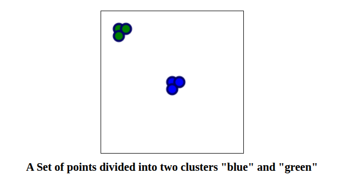

# Web App 


## Reference Design



Best practises for interfacing from the browser in to RUST code 
are in a state of flux.

The application details the extra build steps than are neede to package a rust application for the web.

Prerequists
install [npm]( <https://docs.npmjs.com/downloading-and-installing-node-js-and-npm>)
install [webpack](<https://webpack.js.org/>)
```bash
cd geo/geo/examples/web-app
npm install
```

To see the web page run 

```bash
cd geo/geo/examples/web-app
npm run start
```

Here is an outline:-
  1) RUST runs in a sandboxed web-worker. By design only the main loop can access the DOM.
  2) wasm-pack builds a web-worker npm module with the appropiate RUST/JS bindings.
  3) The web page links to a js module page loads a RUSTLANG web-worker.
